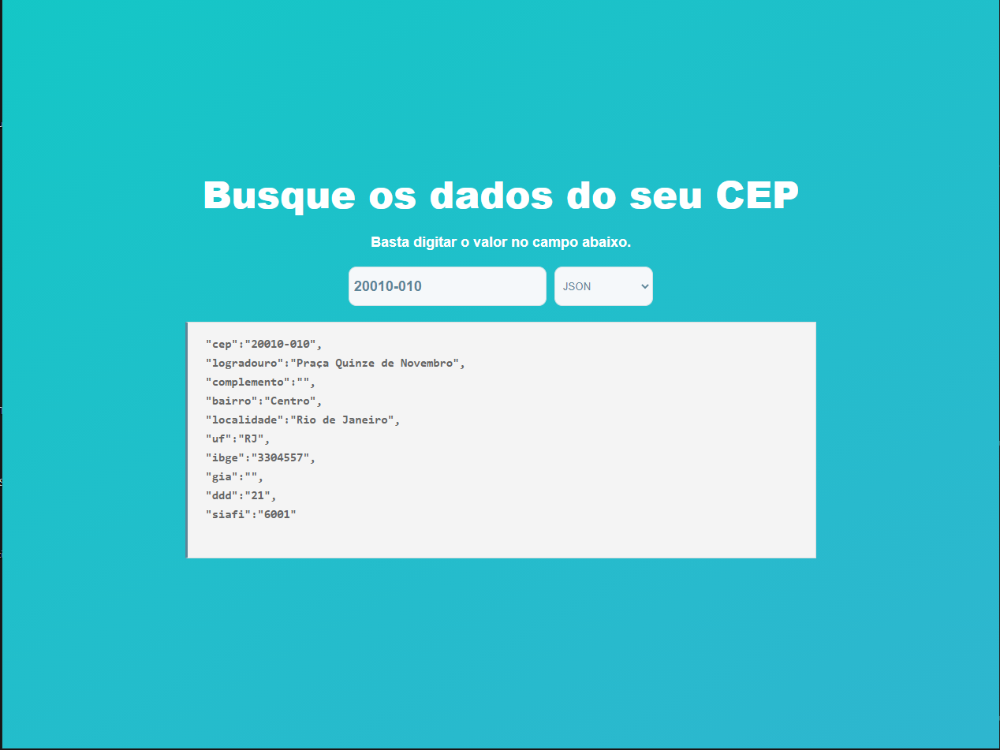

# Design ViaCEP

Design de pesquisa de CEPS



## Download

```bash
git clone https://github.com/dougcarvalho92/viacep-design.git
```

## Dependências

Use o gerenciador de pacote [yarn](https://yarnpkg.com/) para instalar as dependencias do projeto.

```bash
yarn
```


## 2 - Projeto online
Acesse - [https://teste-vx-comunicacao.netlify.app/#/](https://teste-vx-comunicacao.netlify.app/#/)

Dados fornecidos pela API [viacep](https://viacep.com.br/)

